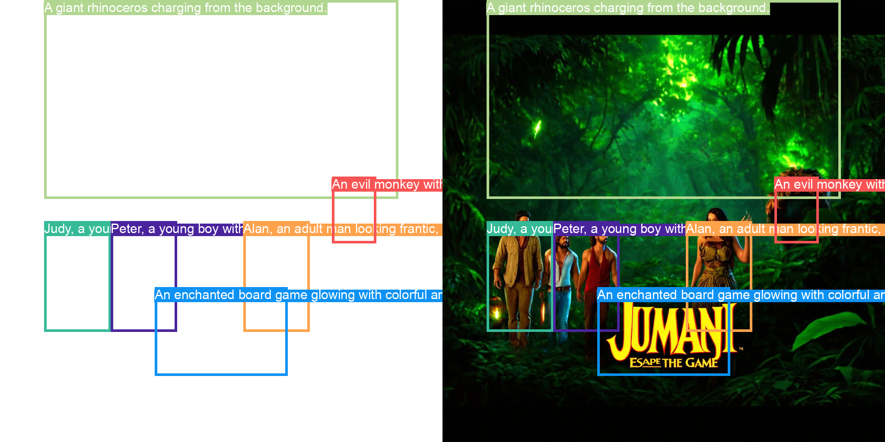

# 🎬 Movie Recommendation + Thumbnail Layout & Diffusion

본 프로젝트는 넷플릭스의 개인화 추천 시스템의 동작 원리를 알아보고자 진행되었습니다. 사용자가 시청한 영화 데이터를 바탕으로 영화 추천을 진행하고, 추천 결과를 활용해 영화 썸네일 레이아웃을 생성하며, Stable Diffusion 기반의 이미지 생성으로 최종 영화 포스터(썸네일)를 만드는 통합 시스템을 직접 구현하였습니다.


## 📚 추가 자료 및 참고 링크
- [Notion 프로젝트 페이지](https://www.notion.so/naye971012/Personalized-Thumnail-389d50b79edf41c9a059e38a79b40994)


## 🚀 주요 기능

1. **영화 추천 (SASRec 모델)**
   - 사용자가 시청한 영화(제목 선택)를 입력하면, SASRec 모델을 이용해 영화 추천을 진행합니다.
   - 추천 결과는 영화 포스터, 장르, 개요 등의 정보와 함께 표시됩니다.

2. **ChatGPT 기반 레이아웃 생성 및 편집**
   - 추천 영화들의 개요를 바탕으로 자동 생성된 시나리오를 활용하여, ChatGPT가 영화 썸네일 레이아웃(객체, 특징, 바운딩 박스 좌표 등)을 생성합니다.
   - 생성된 레이아웃은 사용자가 미리보기 및 수정할 수 있도록 제공됩니다.

3. **Diffusion 기반 이미지 생성 (CreatiLayout Pipeline)**
   - 편집된 레이아웃 정보를 바탕으로 Stable Diffusion 및 레이아웃 Transformer 모델(예: CreatiLayout)을 이용하여 최종 영화 썸네일 이미지를 생성합니다.
   - 이미지 생성 과정 중 5 스텝마다 중간 결과가 업데이트되어 실시간으로 확인할 수 있습니다.
   - 최종 생성 이미지와 객체 바운딩 박스가 시각화된 이미지가 각각 저장됩니다.

4. **프로세스 요약 이미지 생성**
   - 시청한 영화, 추천 영화, 시나리오, 최종 레이아웃 등의 정보를 텍스트 블록으로 구성하고, 최종 생성 이미지와 레이아웃 시각화 이미지를 합성하여 “프로세스 요약 이미지”를 생성합니다.
   - 생성된 요약 이미지는 다운로드 버튼을 통해 저장할 수 있습니다.

5. **PDF 파일 직접 표시 (옵션)**
   - PDF 파일(예: 포스터 퍼스널라이즈드 썸네일)을 직접 보여주고 싶다면, 아래와 같은 코드를 활용하여 Streamlit 인터페이스 내에 PDF를 임베드할 수 있습니다.


## 🖼️ 이미지 예시

- **레이아웃 → 이미지 변환 예시**  
  

- **최종 썸네일 예시**  
  
  


## 🔧 실행 방법

1. **환경 설정**  
   - 프로젝트 루트에 `.env` 파일을 생성하고, 필요한 환경 변수(API_KEY 등)를 설정합니다.

2. **라이브러리 설치**  
   ```bash
   pip install -r requirements.txt
   ```
3. **Streamlit 앱 실행**
   ```bash
    streamlit run OverallCode.py
   ```

## 💻 프로젝트 구성 및 주요 파일

- **코드 구성**
  - `OverallCode.py`: Streamlit 인터페이스를 통한 영화 추천, 레이아웃 생성, 이미지 생성, 프로세스 요약 이미지 생성의 전체 플로우를 제어합니다.
  - `src/SASRec`: 영화 추천 모델(SASRec) 관련 코드와 데이터 처리 모듈.
  - `src/CreatiLayout`: ChatGPT를 통한 레이아웃 생성, Stable Diffusion 및 Layout Transformer를 활용한 이미지 생성 파이프라인 코드.
  
- **데이터 및 모델 파일**
  - 영화 메타데이터 파일: `src/SASRec/ml-1m_original_data/movies.dat`
  - 상세 영화 메타데이터 CSV: `src/movies_metadata.csv`
  - SASRec 학습된 모델 파일: `src/SASRec/ml-1m_default/SASRec.epoch=1000.lr=0.001.layer=2.head=1.hidden=50.maxlen=200.pth`
  
- **출력 경로**
  - 생성된 최종 이미지: `output/images`
  - 레이아웃 시각화 이미지: `output/images_with_layout`


## 📁 설치 및 실행 방법

1. **환경 설정**
   - Python 3.x 버전을 사용합니다.
   - 프로젝트 루트에 `.env` 파일을 생성한 후, OpenAI API Key (예: `API_KEY`) 등 필요한 환경변수를 설정합니다.

2. **필요한 라이브러리 설치**
   ```bash
   pip install -r requirements.txt
   ```

3. **프로젝트 실행 (Streamlit 앱)**
   ```bash
   streamlit run OverallCode.py
   ```

4. **웹 인터페이스 사용**
   - **영화 추천**: 시청한 영화 목록을 선택하여 추천 영화 정보를 확인합니다.
   - **레이아웃 생성 및 편집**: 추천 영화의 개요를 기반으로 자동 생성된 시나리오를 확인하고, ChatGPT가 생성한 썸네일 레이아웃을 미리보기 및 수정합니다.
   - **이미지 생성**: CreatiLayout 파이프라인을 통해 최종 영화 썸네일 이미지를 생성하며, 생성 과정 중 중간 결과를 실시간으로 확인합니다.
   - **프로세스 요약 이미지**: 전체 프로세스(추천, 레이아웃, 최종 이미지)를 요약한 이미지를 생성하고 다운로드할 수 있습니다.


## 추가 참고 사항

- **GPU 지원**
  - GPU가 사용 가능한 경우 CUDA를 자동으로 활용합니다. 그렇지 않으면 CPU로 실행됩니다.
  
- **모델 및 API 업데이트**
  - ChatGPT 요청 시 사용되는 모델(`gpt-4o-mini`)이나, 기타 모델 경로는 실제 환경에 맞게 수정이 필요합니다.
  
- **환경 설정**  
  - `.env` 파일을 생성하고, 필요한 환경 변수(API_KEY 등)를 설정합니다.
